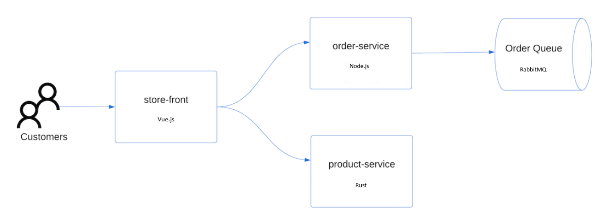

# 2. 샘플 애플리케이션 구성

이번 실습에서는 Azure Kubernetes Service(AKS)에서 사용할 샘플 애플리케이션을 구성합니다. Azure에서 제공되는 샘플 애플리케이션을 로컬에서 빌드하고 테스트한 후, AKS에서 이미지를 구성하는데 사용할 컨테이너 레지스트리(Azure Container Registry; ACR)에 업로드합니다.

이번 실습에서는 로컬 환경에 Docker Engine이 구성되어 있어야 합니다. 

### 샘플 애플리케이션 복제

이 실습에서는 아래와 같은 샘플 애플리케이션을 사용합니다.



- **스토어 프런트**: 고객이 제품을 보고 주문을 할 수 있는 웹 애플리케이션
- **제품 서비스**: 제품 정보를 표시하는 서비스
- **주문 서비스**: 주문 서비스
- **Rabbit MQ**: 주문 큐에 대한 메시지 큐

1. 아래 명령어를 사용해서 샘플 애플리케이션을 로컬에 복제합니다.
    
    ```bash
    git clone https://github.com/Azure-Samples/aks-store-demo.git
    ```
    
2. Visual Studio Code 같은 IDE를 사용하여 해당 폴더를 엽니다.

### 컨테이너 이미지 생성

1. 아래 명령어를 사용하여 컨테이너 이미지를 만들고, `docker compose` 명령어를 사용해서 애플리케이션을 시작합니다.
    
    ```bash
    docker compose -f docker-compose-quickstart.yml up -d
    ```
    
2. `docker images` 명령어를 사용하여 생성된 이미지를 확인합니다.
    
    
    
3. `docker ps` 명령어를 사용하여 실행 중인 컨테이너를 확인합니다.
    
    
    
4. 컨테이너가 정상적으로 실행 중이라면, 웹 브라우저에서 [http://localhost:8080](http://localhost:8080) 에 접속하여 샘플 애플리케이션을 확인합니다.
    
    