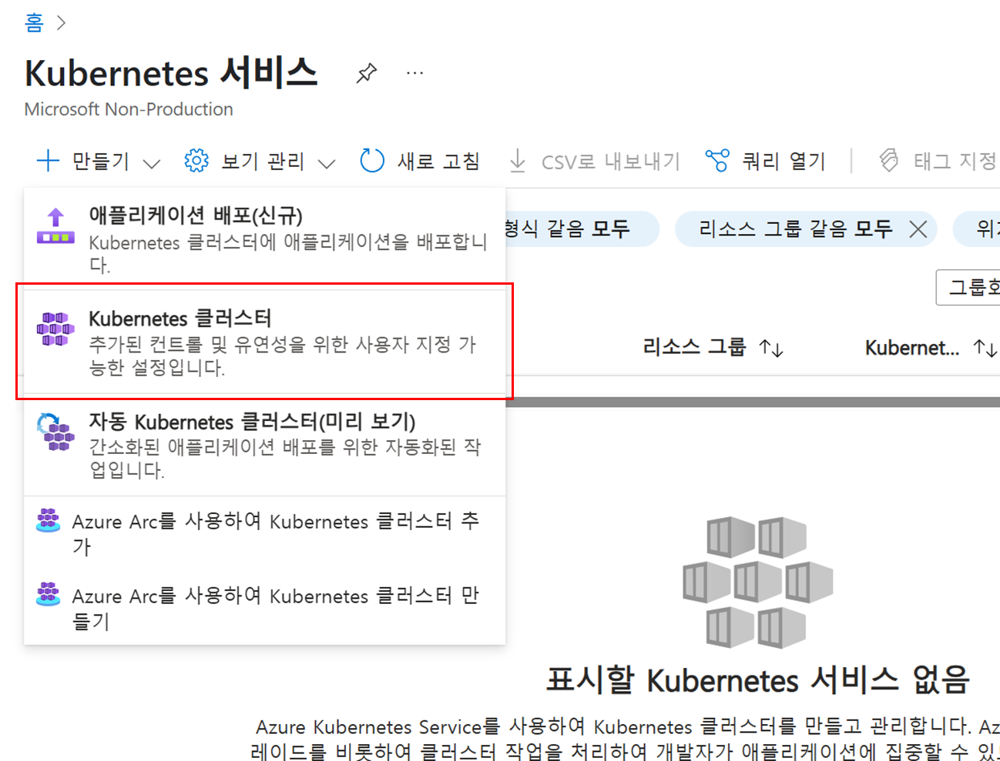

# 4. AKS 클러스터 만들기

Kubernetes는 컨테이너화된 애플리케이션에 대해 분산 플랫폼을 제공합니다. AKS(Azure Kubernetes Service)를 사용하면 프로덕션 준비 Kubernetes 클러스터를 신속하게 만들 수 있습니다.

## AKS 클러스터 만들기

1. Azure 포털 서비스 검색 상자에서 `AKS` 또는 `Kubernetes 서비스`를 입력합니다.
2. 왼쪽 상단의 `만들기` 버튼을 클릭합니다.
3. `Kubernetes 클러스터`를 선택합니다.
    
    
    
4. 기본 사항 탭을 아래와 같이 구성합니다.
    - 구독 : 사용할 구독 선택
    - 리소스 그룹 : AKSWorkshopResourceGroup
    - 클러스터 사전 설정 구성 : 프로덕션 표준
    - Kubernetes 클러스터 이름 : AKSSampleCluster
    - 지역 : (Asia Pacific) Korea Central
    - 인증 및 권한 부여 : Kubernetes RBAC가 있는 로컬 계정
    
    <aside>
    💡
    
    AKS는 다음의 세 가지 인증 및 권한 부여 방법을 제공합니다.
    
    - Kubernetes RBAC가 있는 로컬 계정
    - Kubernetes RBAC를 사용한 Microsoft Entra ID 인증
    - Azure RBAC를 사용한 Microsoft Entra ID 인증
    </aside>
    
5. 나머지 설정은 그대로 두고 `다음` 버튼을 클릭합니다. 
6. 노드 풀에서 아래 항목을 확인하고 `다음` 버튼을 클릭합니다.
    
    
    
    - agentpool (시스템 노드 풀) : CoreDNS 및 konnectivity와 같은 중요 시스템 Pod를 호스트
    - userpool (사용자 노드 풀) : 컴퓨팅 또는 스토리지 수요가 다른 애플리케이션을 지원, 애플리케이션 Pod를 호스트
7. 네트워킹 탭에서 아래 항목들을 확인하고 `다음` 버튼을 클릭합니다.
    - 컨테이너 네트워킹
        - 네트워크 구성 : Azure CNI 오버레이
        - 네트워크 정책 : 없음
8. 통합 탭에서 Azure Container Registry에서 생성한 `<alias>samplerepo`를 선택하고 `다음` 버튼을 클릭합니다.
9. 모니터링 탭에서 아래와 같이 구성하고 `검토 + 만들기` 버튼을 클릭합니다.
    - 컨테이너 인사이트
        - 컨테이너 로그 사용 : 체크
        - Log Analytics 작업 영역
            - 새로 만들기 클릭
            - 지역 : (Asia Pacific) Korea Central
            - 리소스 그룹 : 자동 지정
            - Log Analytics 작업 영역 : AKSLogWorkspace
10. 검토 + 만들기 화면에서 구성한 내용을 확인하고 `만들기` 버튼을 클릭합니다. (클러스터 생성에는 10~15분이 소요됩니다.)

### kubectl을 사용하여 클러스터에 연결

1. `az aks get-credentials` 명령을 사용하여 Kubernetes 클러스터에 연결하도록 `kubectl`을 구성합니다. (일반적으로 User 디렉터리\.kube\config 파일에 구성이 설정됩니다.)
    
    ```bash
    az aks get-credentials --resource-group AKSWorkshopResourceGroup --name AKSSampleCluster
    ```
    
2. 아래 명령어를 실행하여 정상적으로 클러스터에 연결되는지 테스트합니다.
    
    ```bash
    kubectl get nodes
    ```
    
    