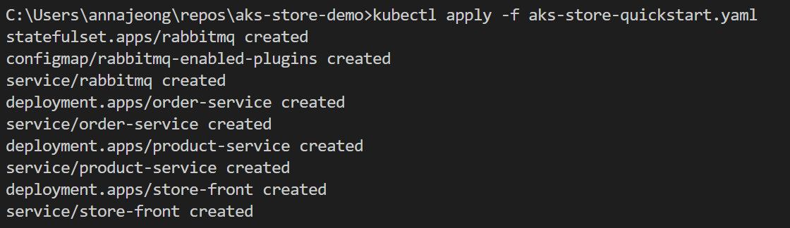

# 5. AKS에 애플리케이션 배포

이번 실습에서는 샘플 애플리케이션을 Kubernetes 클러스터에 배포합니다.

이 전 단계에서 애플리케이션을 컨테이너 이미지로 패키지하고, 컨테이너 레지스트리에 업로드했습니다. 이 실습에서는 로컬에 다운로드 받은 소스코드의 Kubernetes 매니페스트 파일을 수정하여 애플리케이션을 AKS 클러스터에 배포해보도록 하겠습니다.

## 샘플 애플리케이션 배포

### 매니페스트 파일 업데이트

ACR(Azure Container Registry) 인스턴스는 샘플 애플리케이션에 대한 컨테이너 이미지를 저장합니다. 애플리케이션을 배포하려면 ACR 로그인 서버 이름을 포함하도록 Kubernetes 매니페스트 파일의 이미지 이름을 업데이트해야 합니다.

3번 실습에서 구성한 ACR 이름을 사용합니다.

1. Visual Studio Code(또는 사용하는 IDE)에서 로컬에 다운로드 받은 `aks-store-demo` 디렉터리 내에 `aks-store-quickstart.yaml` 매니페스트 파일을 엽니다.
2. [ghcr.io/azure-samples를](http://ghcr.io/azure-samples를) ACR 로그인 서버 이름으로 바꿔 컨테이너의 `image` 속성을 업데이트 합니다.
    
    ```yaml
    containers:
    ...
    - name: order-service
      image: <acrName>.azurecr.io/aks-store-demo/order-service:latest
    ...
    - name: product-service
      image: <acrName>.azurecr.io/aks-store-demo/product-service:latest
    ...
    - name: store-front
      image: <acrName>.azurecr.io/aks-store-demo/store-front:latest
    ...
    ```
    

### 애플리케이션 실행

1. `kubectl apply` 명령어를 사용하여 애플리케이션을 배포합니다.
    
    ```bash
    kubectl apply -f aks-store-quickstart.yaml
    ```
    
    
    
2. `kubectl get pods` 명령어를 사용하여 애플리케이션 배포가 정상적으로 실행되었는지 확인합니다.
    
    ```bash
    kubectl get pods
    ```
    
    
    

### 애플리케이션 테스트

애플리케이션이 실행되면 애플리케이션 프런트 엔드를 인터넷에 공개하는 Kubernetes 서비스가 만들어집니다. 이 프로세스를 완료하는 데 몇 분이 걸릴 수 있습니다.

1. `kubectl get service` 명령어와 `--watch` 옵션을 사용하여 진행률을 모니터링합니다.
2. `store-front` 서비스의 `EXTERNAL-IP`가 공용 IP 주소로 변경되면 `Ctrl-C`를 사용하고 공용 IP를 복사하여 브라우저에 입력합니다.
    
    