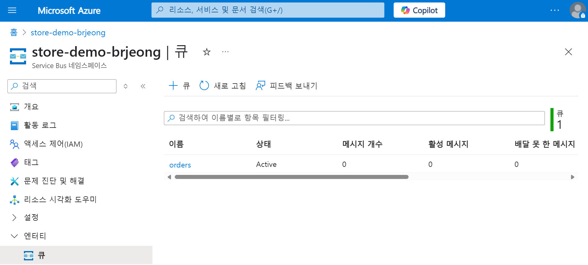

# 6. PaaS 연동

AKS 클러스터에서는 Azure의 다른 PaaS 서비스와의 연동을 구성할 수 있습니다. 샘플 애플리케이션은 order-service에서 요청한 주문을 RabbitMQ 컨테이너에 저장합니다.

Azure Service Bus는 메시지 큐와 Pub-Sub 토픽이 있는 관리형 엔터프라이즈 메시지 브로커입니다. Service Bus 큐를 사용하여 애플리케이션 간 메시지를 주고 받을 수 있도록 구성해 보도록 하겠습니다.

## Azure Service Bus 구성

### 네임스페이스 만들기

1. Azure 포털 서비스 검색 상자에서 `Service Bus`를 입력합니다.
2. 왼쪽 상단 `만들기` 버튼을 클릭합니다.
3. 아래와 같이 구성하고 `검토 + 만들기`, `만들기` 버튼을 클릭하여 네임스페이스를 생성합니다.
    - 구독 : 사용할 구독 선택
    - 리소스 그룹 : AKSWorkshopResourceGroup
    - 네임스페이스 이름 : store-demo-<alias>
    - 위치 : Korea Central
    - 가격 책정 계층 : 표준 (매월 12.5M 작업당 ~$10 USD)

### 큐 만들기

1. 생성된 `Service Bus` 화면으로 이동합니다.
2. 왼쪽 블레이드에서 `엔터티 > 큐` 를 선택합니다.
3. 상단 `+ 큐` 버튼을 클릭합니다.
4. 큐 이름을 `orders`로 지정하고 나머지 구성은 그대로 두고 `만들기` 버튼을 클릭합니다.
    
    
    
5. 생성한 `orders`를 클릭합니다.
6. orders 개요 화면에서 `큐 URL`을 복사해 둡니다.
    
    
    
7. 애플리케이션에서 사용할 수 있도록 자격 증명을 생성합니다. 왼쪽 메뉴에서 `설정 > 공유 액세스 정책` 을 클릭합니다.
8. 상단 `추가` 버튼을 클릭합니다.
9. 정책 이름에 `sender`를 입력하고 `보내기`를 체크하고 `만들기` 버튼을 클릭합니다.
    
    
    
10. 생성한 `sender` 자격 증명을 선택하고 애플리케이션에서 사용할 `기본 키`를 복사합니다.
    
    
    

## 샘플 애플리케이션 구성 업데이트

1. 로컬 터미널에서 az aks get-credentials 명령어를 사용하여 클러스터 액세스 권한을 업데이트합니다.
    
    ```bash
    az aks get-credentials --resource-group AKSWorkshopResourceGroup --name AKSSampleCluster
    ```
    
2. Visual Studio Code(또는 사용하는 IDE)에서 로컬에 다운로드 받은 `aks-store-demo` 디렉터리 내에 `aks-store-quickstart.yaml` 매니페스트 파일을 엽니다.
3. 기존 `rabbitmq` StatefulSet, ConfigMap, Service섹션**(1~73라인)**을 제거하고 기존 `order-service` Deployment 섹션**(1~73라인)**을 다음과 같이 대체합니다.
    
    ```yaml
    apiVersion: apps/v1
    kind: Deployment
    metadata:
      name: order-service
    spec:
      replicas: 1
      selector:
        matchLabels:
          app: order-service
      template:
        metadata:
          labels:
            app: order-service
        spec:
          nodeSelector:
            "kubernetes.io/os": linux
          containers:
          - name: order-service
            image: <REPLACE_WITH_YOUR_ACR_NAME>.azurecr.io/aks-store-demo/order-service:latest
            ports:
            - containerPort: 3000
            env:
            - name: ORDER_QUEUE_HOSTNAME
              value: "<REPLACE_WITH_YOUR_SB_NS_HOSTNAME>" # Example: sb-store-demo-123456.servicebus.windows.net
            - name: ORDER_QUEUE_PORT
              value: "5671"
            - name: ORDER_QUEUE_TRANSPORT
              value: "tls"
            - name: ORDER_QUEUE_USERNAME
              value: "sender"
            - name: ORDER_QUEUE_PASSWORD
              value: "<REPLACE_WITH_YOUR_SB_SENDER_PASSWORD>"
            - name: ORDER_QUEUE_NAME
              value: "orders"
            - name: FASTIFY_ADDRESS
              value: "0.0.0.0"
            resources:
              requests:
                cpu: 1m
                memory: 50Mi
              limits:
                cpu: 75m
                memory: 128Mi
    ```
    
4. `kubectl apply` 명령어를 사용하여 업데이트된 애플리케이션을 배포합니다.
    
    ```bash
    kubectl apply -f aks-store-quickstart.yaml
    ```
    
    
    

### 애플리케이션 테스트

1. 브라우저에서 `store-front` 페이지의 `공용 IP 주소`에 접속합니다.
    
    ```bash
    kubectl get service store-front
    ```
    
2. 제품을 선택하고 `Add to Cart` 버튼을 클릭합니다.
3. 오른쪽 상단의 `Cart (1)` 를 클릭합니다.
4. `Checkout` 버튼을 클릭하여 주문을 생성합니다.
    
    
    

### Azure Service Bus 큐에서 주문 확인하기

1. Azure 포털에서 생성한 Azure Service Bus 네임스페이스 화면으로 이동합니다.
2. 왼쪽 블레이드에서 `엔터티 > 큐`를 선택합니다.
3. 목록에서 `orders` 큐를 클릭합니다.
4. 왼쪽 블레이드에서 `Service Bus 탐색기`를 클릭합니다.
5. `처음부터 피킹 버튼`을 클릭하여 전달된 주문 내역을 확인합니다.
    
    