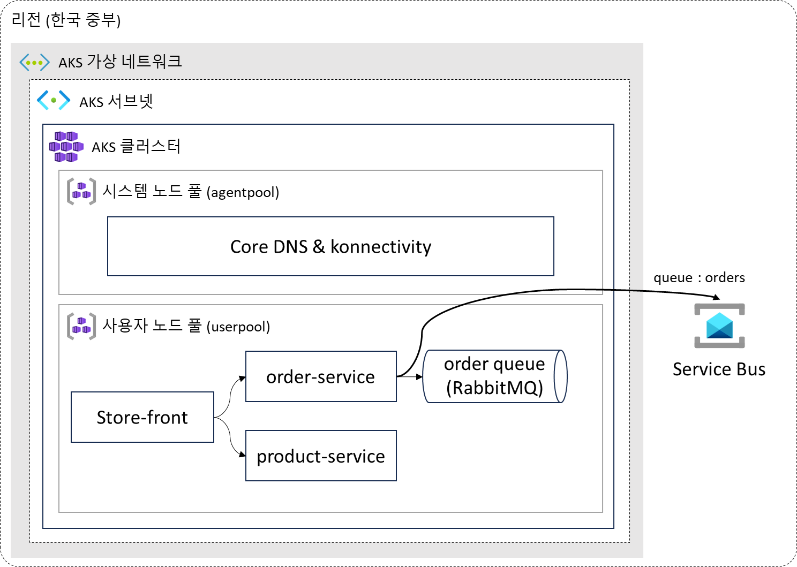

# AKS Basic Workshop

[예상 소요 시간 : 2시간]

이번 실습은 Azure의 관리형 Kubernetes 서비스인 Azure Kubernetes Service(AKS)를 배포하고, Azure에서 제공되는 aks-store-demo 애플리케이션을 구성해 보는 실습입니다.

샘플 애플리케이션은 화면을 제공하는 store-front, 상품 정보를 제공하는 product-service, 주문을 처리하는 order-service 세 개의 컨테이너로 이루어져 있습니다. 여기에 주문 정보를 처리하기 위한 RabbitMQ 컨테이너가 구성되어 있으며, 이 부분을 Azure의  관리형 엔터프라이즈 메시지 브로커인 Service Bus 서비스로 변경하여 구성하는 내용이 포함되어 있습니다.

[1. 준비 사항](./1.%20준비%20사항/)

[2. 샘플 애플리케이션 구성](./2.%20샘플%20애플리케이션%20구성/)

[3. 컨테이너 레지스트리 만들기](./3.%20컨테이너%20레지스트리%20만들기/)

[4. AKS 클러스터 만들기](./4.%20AKS%20클러스터%20만들기/)

[5. 클러스터에 애플리케이션 배포](./5.%20클러스터에%20애플리케이션%20배포/)

[6. PaaS 연동](./6.%20PaaS%20연동/)

[7. 리소스 정리](./7.%20리소스%20정리/)

이 실습은 [`Microsoft Learn - AKS 자습서`](https://learn.microsoft.com/ko-kr/azure/aks/tutorial-kubernetes-prepare-app?tabs=azure-cli)를 참고하여 작성되었습니다.